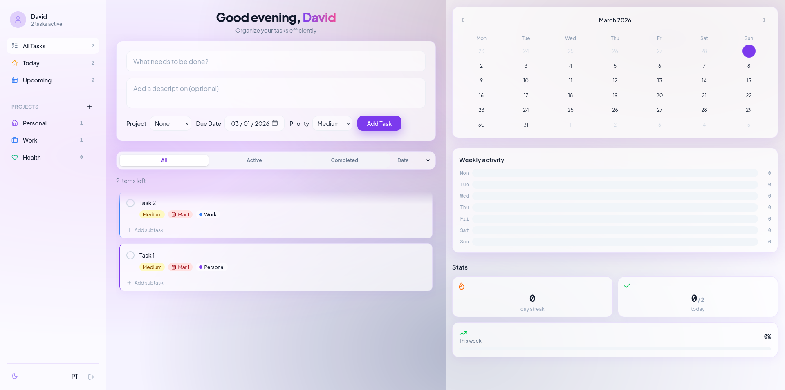
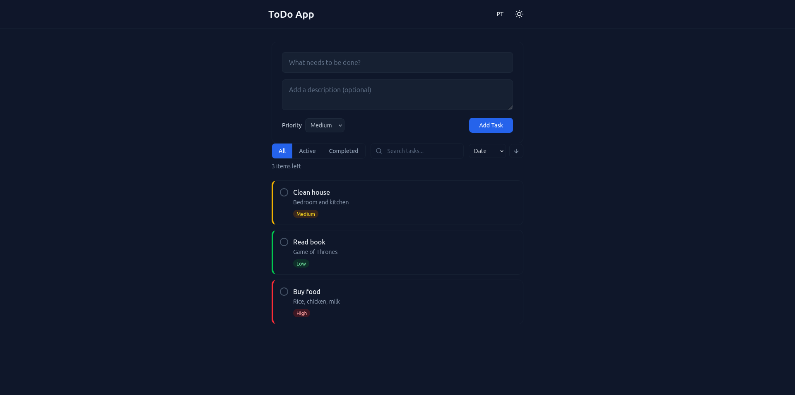
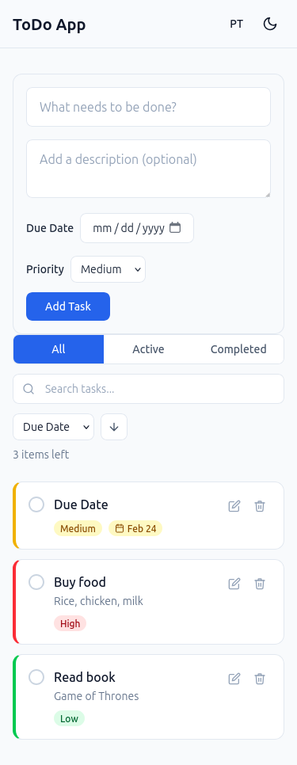
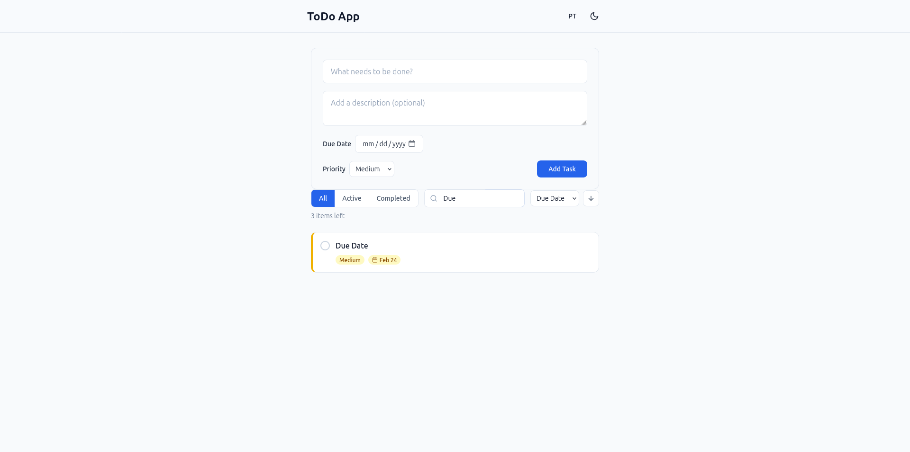

---
# ToDo App — Angular 21 + TailwindCSS

A modern task management application built as a technical assessment for **Domoweb / NHCLIMA**.

[Live Demo](https://daevid-noface.github.io/todo-app/)



---

## Features

### Core

- Full CRUD (create, read, update, delete tasks)
- Filter by status (All / Active / Completed)
- Search tasks by title or description
- Sort by date, priority, or due date (ascending/descending)
- Due dates with color-coded badges (overdue, upcoming, on time)
- Dark / Light theme with system preference detection
- Internationalization (English & Português EN-PT)
- Data persistence with localStorage
- Fully responsive (mobile & desktop)

### Bonus

- User authentication with per-user task isolation
- Route guards (unauthenticated users redirected to login)
- Zoneless change detection (no Zone.js)
- Unit tests with Vitest
- Animations (fade/slide transitions on tasks and toasts)
- Accessibility (ARIA labels, keyboard navigation, skip link, live regions)
- GitHub Pages deployment

---

## Tech Stack

| Technology  | Version         | Purpose                   |
| ----------- | --------------- | ------------------------- |
| Angular     | 21.1.x          | Frontend framework        |
| TailwindCSS | 4.x             | Utility-first CSS         |
| TypeScript  | Strict mode     | Type safety               |
| Vitest      | Built-in        | Unit testing              |
| Signals     | Angular Signals | Reactive state management |

---

## Technical Decisions

### Why Angular 21 instead of 18?

The requirement states "Angular 18+". Angular 21 is the current stable version and brings significant
improvements:

- **Zoneless by default** — No Zone.js overhead, better performance
- **Vitest** — Modern test runner replacing Karma
- **Signal-based reactivity** — Granular change detection, no unnecessary re-renders

### Why Signals instead of NgRx/RxJS?

For a single-entity app (todos), Signals provide:

- **Simpler API** — No boilerplate (actions, reducers, effects)
- **Built-in to Angular** — No extra dependencies
- **Granular reactivity** — Only affected components update
- **Computed signals** — Derived state (filtered/sorted todos) recalculates automatically

NgRx would be overkill here. Signals are the right tool for this scope.

### Why custom i18n instead of @angular/localize?

- **Runtime language switching** — `@angular/localize` requires a full rebuild per language
- **Lightweight** — Simple service + pipe, no complex setup
- **Interpolation support** — `{{count}} items left` works with params

### Why TailwindCSS v4?

- **CSS-first configuration** — No `tailwind.config.js` needed
- **`@theme` directive** — Custom design tokens directly in CSS
- **`@custom-variant`** — Dark mode variant without JavaScript

### Architecture: Smart vs Presentational Components

| Component              | Type           | Responsibility                       |
| ---------------------- | -------------- | ------------------------------------ |
| `TodoPageComponent`    | Smart          | Orchestrates state, injects services |
| `TodoFormComponent`    | Presentational | Receives inputs, emits outputs       |
| `TodoItemComponent`    | Presentational | Displays a single todo               |
| `TodoListComponent`    | Presentational | Renders the list                     |
| `TodoFiltersComponent` | Smart          | Directly manages filter state        |

---
  ## Project Structure

  ```
  src/app/
  ├── core/
  │   ├── models/          # Interfaces and types
  │   ├── services/        # Business logic (TodoService, AuthService,
  ThemeService, etc.)
  │   ├── guards/          # authGuard
  │   └── i18n/            # Translation JSON files
  ├── features/
  │   ├── todo/
  │   │   ├── todo-page.*          # Smart component (main page)
  │   │   └── components/          # Presentational components
  │   │       ├── todo-form/
  │   │       ├── todo-item/
  │   │       ├── todo-list/
  │   │       └── todo-filters/
  │   └── auth/
  │       ├── login/
  │       └── register/
  └── shared/
      ├── pipes/           # TranslatePipe
      ├── animations/      # fadeSlideIn, fadeToast
      ├── components/      # Header, ConfirmDialog
      └── toast/           # Toast notification system
  ```
---

Screenshots





## Getting Started

### Prerequisites

- Node.js 18+
- npm 9+

### Installation

```bash
git clone https://github.com/daevid-noface/todo-app.git
cd todo-app
npm install

Development

ng serve

Open http://localhost:4200

Tests

ng test

Build

ng build

---
```
